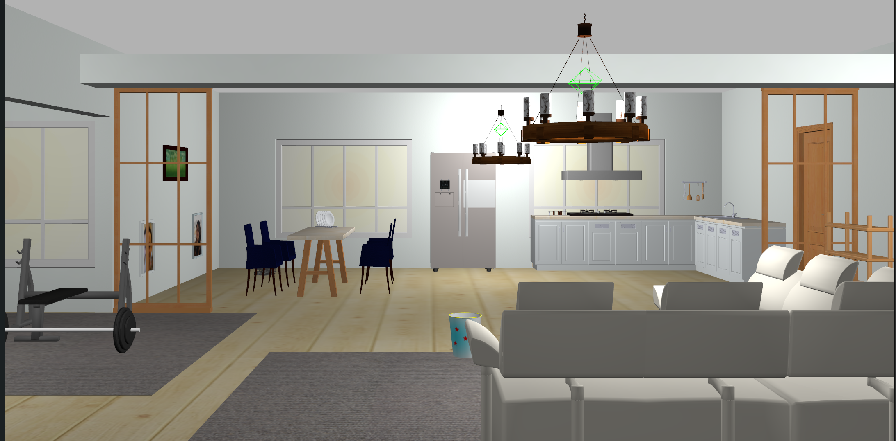

<a name="readme-top"></a>

[JA](README.md) | [EN](README_en.md)

[![Contributors][contributors-shield]][contributors-url]
[![Forks][forks-shield]][forks-url]
[![Stargazers][stars-shield]][stars-url]
[![Issues][issues-shield]][issues-url]
[![License][license-shield]][license-url]

# AWS Small House World



<!-- TABLE OF CONTENTS -->
<details>
  <summary>Table of Contents</summary>
  <ol>
    <li>
      <a href="#introduction">Introduction</a>
    </li>
    <li>
      <a href="#getting-started">Getting Started</a>
      <ul>
        <li><a href="#prerequisites">Prerequisites</a></li>
        <li><a href="#installation">Installation</a></li>
      </ul>
    </li>
    <li><a href="#launch-and-usage">Launch and Usage</a></li>
    <li><a href="#how-to-replace-photos-in-picture-frames">How to Replace Photos in Picture Frames</a></li>
    <li><a href="#license">License</a></li>
  </ol>
</details>


<!-- INTRODUCTION -->
## Introduction
This package imports and launches the World and models of the household environment, provided by AWS, on Gazebo Sim.


<!-- GETTING STARTED -->
## Getting Started

This section describes how to set up this repository.

<p align="right">(<a href="#readme-top">back to top</a>)</p>


### Prerequisites

First, please set up the following environment before proceeding to the next installation stage.

| System  | Version |
| --- | --- |
| Ubuntu | 22.04 (Jammy Jellyfish) |
| ROS    | Humble Hawksbill |
| Python | 3.10 |
| Gazebo | Fortress |

> [!NOTE]
> If you need to install `Ubuntu` or `ROS`, please check our [SOBITS Manual](https://github.com/TeamSOBITS/sobits_manual#%E9%96%8B%E7%99%BA%E7%92%B0%E5%A2%83%E3%81%AB%E3%81%A4%E3%81%84%E3%81%A6).

<p align="right">(<a href="#readme-top">back to top</a>)</p>


### Installation

**Development environment (local or Docker) where you will use AWS Small House World**

1. Go to the `src` folder of ROS.
    ```sh
    $ cd ~/colcon_ws/src/
    ```

2. Clone this repository.
    ```sh
    $ git clone -b humble-devel https://github.com/TeamSOBITS/aws_small_house_world
    ```
3. Compile the package.
    ```sh
    $ cd ~/colcon_ws/
    $ colcon build --symlink-install
    $ source ~/colcon_ws/install/setup.sh
    ```
4. Add path to the environment variable GZ_SIM_RESOURCE_PATH.
     ```sh
    $ echo "export GZ_SIM_RESOURCE_PATH=${GZ_SIM_RESOURCE_PATH}:~/colcon_ws/install/aws_small_house_world/share/aws_small_house_world/models" >> ~/.bashrc
    ```

<!-- LAUNCH AND USAGE -->
## Launch and Usage

1. Launch the Small House World model on Gazebo Sim.
    ```sh
    $ ros2 launch aws_small_house_world small_house.launch.py
    ```

## How to Replace Photos in Picture Frames

Picture frames use two textures for the model:
 - `aws_portraitA_01.png` - Frame texture
 - `aws_portraitA_02.png` - Picture texture

To change a picture, one has to replace the `aws_portraitA_02.png` file. The new image will look best with same aspect ratio as the replaced image.

Below is a table showing portrait type to picture resolution data and custom images from photos/.

<details>
<summary>Portrait Model</summary>

| Portrait Model | Resolution | Photo |
| --- | --- | --- |
| DeskPortraitA_01 | 650x1024 | |
| DeskPortraitA_02 | 650x1024 | doug |
| DeskPortraitB_01 | 650x1024 | |
| DeskPortraitB_02 | 650x1024 | |
| DeskPortraitC_01 | 1024x1024 | |
| DeskPortraitC_02 | 1024x1024 | |
| DeskPortraitD_01 | 1024x1024 | |
| DeskPortraitD_02 | 1024x1024 | |
| DeskPortraitD_03 | 1024x1024 | |
| DeskPortraitD_04 | 1024x1024 | ray |
| PortraitA_01 | 700x1024 | tim |
| PortraitA_02 | 700x1024 | anamika |
| PortraitB_01 | 700x1024 | renato |
| PortraitB_02 | 700x1024 | brandon |
| PortraitB_03 | 700x1024 | miaofei |
| PortraitC_01 | 650x1024 | sean |
| PortraitD_01 | 1024x450 | |
| PortraitD_02 | 1024x450 | |
| PortraitE_01 | 700x1024 | maggie |
| PortraitE_02 | 700x1024 | iftach |

</details>


<!-- LICENSE -->
## License

This software except object models is released under the MIT License, see [LICENSE.txt](license-url).

See the [open issues][issues-url] for a full list of proposed features (and known issues).


<!-- REFERENCES -->
## References

* [Gazebo Sim](https://gazebosim.org)
* [aws-robomaker-small-house-world](https://github.com/aws-robotics/aws-robomaker-small-house-world)


<p align="right">(<a href="#readme-top">back to top</a>)</p>

<!-- MARKDOWN LINKS & IMAGES -->
<!-- https://www.markdownguide.org/basic-syntax/#reference-style-links -->
[contributors-shield]: https://img.shields.io/github/contributors/TeamSOBITS/aws_small_house_world.svg?style=for-the-badge
[contributors-url]: https://github.com/TeamSOBITS/aws_small_house_world/graphs/contributors
[forks-shield]: https://img.shields.io/github/forks/TeamSOBITS/aws_small_house_world.svg?style=for-the-badge
[forks-url]: https://github.com/TeamSOBITS/aws_small_house_world/network/members
[stars-shield]: https://img.shields.io/github/stars/TeamSOBITS/aws_small_house_world.svg?style=for-the-badge
[stars-url]: https://github.com/TeamSOBITS/aws_small_house_world/stargazers
[issues-shield]: https://img.shields.io/github/issues/TeamSOBITS/aws_small_house_world.svg?style=for-the-badge
[issues-url]: https://github.com/TeamSOBITS/aws_small_house_world/issues
[license-shield]: https://img.shields.io/github/license/TeamSOBITS/aws_small_house_world.svg?style=for-the-badge
[license-url]: LICENSE